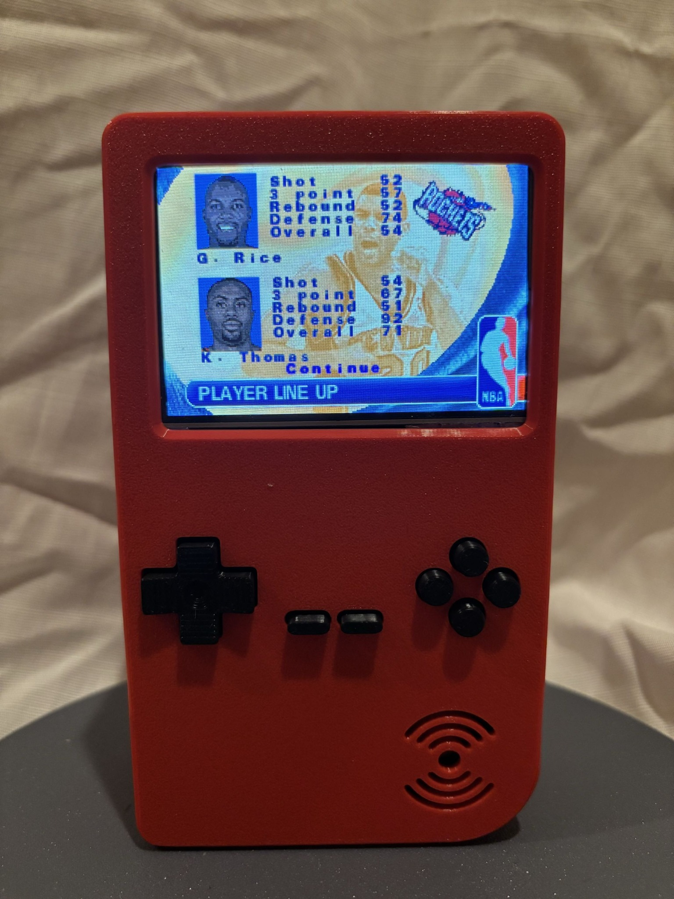
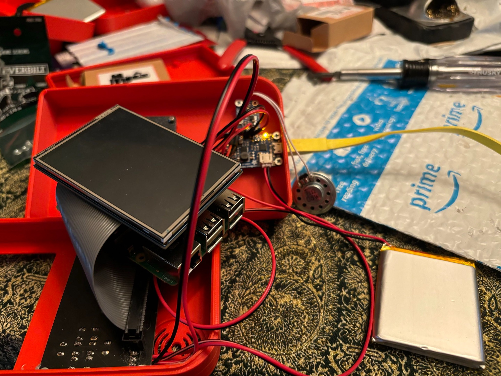
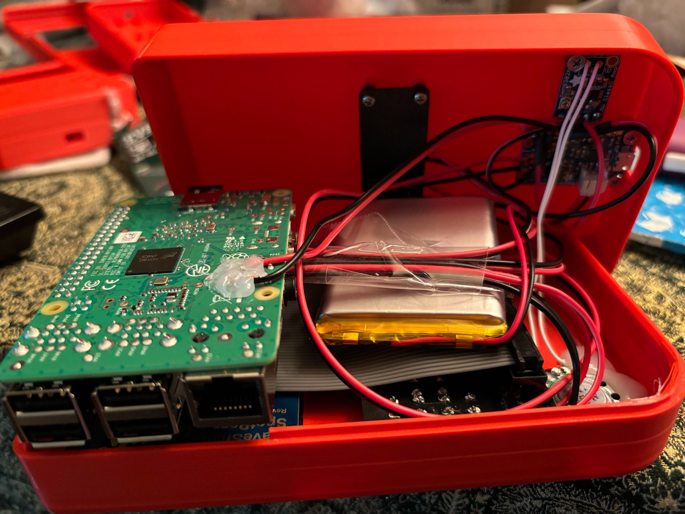

# Raspberry Pi 4 Handheld — PiGRRL 2 Inspired

**July–August 2024 · Hardware integration · Meshmixer · 3D printing · Embedded Linux**

A handheld emulation system built around a Raspberry Pi 4 Model B, a 5-inch screen, battery power, physical controls, and integrated audio. I adapted the PiGRRL 2 concept to a larger display and different power hardware, developing the enclosure through approximately ten printed iterations.

## My contributions

- **System integration:** Assembled the computer, display, power hardware, controls, speaker, and amplifier into a working handheld.
- **Enclosure development:** Used Meshmixer and repeated print-and-fit iterations to accommodate the larger screen and internal components.
- **Display troubleshooting:** Worked through pixelated output when integrating the replacement screen.
- **Design iteration:** Identified missing ventilation as an enclosure oversight and carried that lesson into the next handheld.

## Hardware and software

| Subsystem | My build |
| --- | --- |
| Computer | Raspberry Pi 4 Model B |
| Display | 5-inch screen |
| Power | Battery and alternative power-supply hardware |
| Input | D-pad and physical game buttons |
| Audio | Speaker and amplifier |
| Enclosure | Custom adaptation developed in Meshmixer and 3D printed |
| Software | Linux-based emulation environment |

The original [PiGRRL 2 guide](https://learn.adafruit.com/pigrrl-2/overview) centers on a Raspberry Pi 2 and 2.8-inch PiTFT. The larger display in my build required changes to the enclosure and component packaging.

## Development and results

| Challenge | Work performed | Outcome |
| --- | --- | --- |
| Insufficient enclosure clearance | Approximately ten printed fit iterations in Meshmixer | Assembled housing, with hot glue used for final closure |
| Pixelated display output | Troubleshot replacement-screen integration | Working display |
| Heat buildup | Identified the lack of dedicated ventilation | Overheating remained a limitation; informed the next design |

This first generation brought the subsystems together into a working prototype. The fit and cooling problems gave me concrete requirements to address in the Pi 5 upgrade.

## Explore the project

My retained Meshmixer files sit alongside Adafruit's unchanged reference input software.

| Resource | Contents |
| --- | --- |
| [Meshmixer design files](cad/) | Two retained enclosure project files |
| [Engineering notes](docs/engineering-notes.md) | Fit iterations, display troubleshooting, and thermal lessons |
| [Software notes](docs/software-notes.md) | Reference input behavior and build differences |
| [Controller source](upstream/Adafruit-Retrogame/retrogame.c) | Adafruit's GPIO-to-keyboard utility |
| [PiGRRL 2 configuration](upstream/Adafruit-Retrogame/configs/retrogame.cfg.pigrrl2) | Original example button mapping |
| [Source provenance](upstream/Adafruit-Retrogame/UPSTREAM.md) | Attribution, revision, and license information |

## Build photos

### Display, controls, audio, and power during assembly

### Internal component layout

## Documentation status

Build photos and two original Meshmixer files are included; the files' correspondence to the final printed revision has not been verified. Exact component models, the display fix, and temperature/runtime measurements were not retained. Adafruit's source is an attributed reference, not recovered device code or a confirmed wiring map for my adaptation.

## Credits

Build inspiration: [Adafruit's PiGRRL 2 by the Ruiz Brothers](https://learn.adafruit.com/pigrrl-2/overview).

Reference input software: [Adafruit-Retrogame](https://github.com/adafruit/Adafruit-Retrogame), originally written by **Phil Burgess for Adafruit Industries**, with subsequent upstream contributions. Original license notices are preserved.

No game ROMs, BIOS files, or disk images are included.

## Related projects

- [Pi 5 handheld — second-generation upgrade](https://github.com/JosephDickey/raspberry-pi-5-handheld)
- [Touchscreen mini TV — earlier embedded media project](https://github.com/JosephDickey/raspberry-pi-touchscreen-tv)
